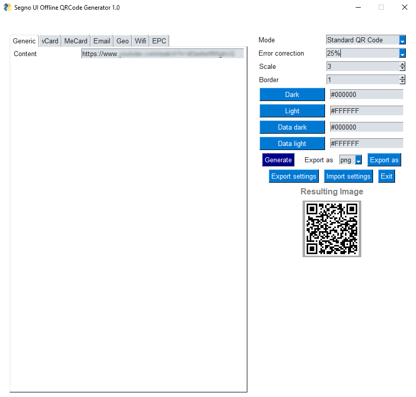

# Segno UI - An open source offline QR Code generator

This program is a graphical user interface for the [segno library](https://github.com/heuer/segno) that allows to create QR codes.

While segno has a nice CLI interface, a graphical user interface fills the gap for quick usage.

The main goal of Segno UI is to provide a QRCode generator that doesn't need any online tools, which guarantees that the data you're encoding doesn't leave your computer.
Using online generators needs you to put your trust in developper behind the tool, hoping that your data won't be stored or reselled.

## Quick usage

You may find **precompiled binaries for Windows** on the [release page](https://github.com/netinvent/segno_ui/releases).

We don't provide precompiled binaries for Linux or MacOS, as those generally come with a Python interpreter already.

Install with:
```
python3 -m pip install segno_ui
```

Use with:
```
segno_ui.py
```

Depending on your system, you might need to install tkinter. Install with
| System                                 | command                                  |
|----------------------------------------|------------------------------------------|
| RHEL 8+, Fedora and clones             | `dnf install python3-tkinter`            |
| RHEL and earlier Fedora and clones     | `yum install tkinter`                    |
| Debian, Ubuntu, Mint based             | `sudo apt-get install python-tk`         |
| Arch based                             | `sudo pacman -S tk`                      |
| Windows                                | Select 'tk' when installing Python       |

## Graphical user interface

Graphical user interface supports importing and exporting presets using json files.
QRCode generation is made on changes.




## Technical stuff

Basically, Segno UI is a wrapper using the excellent [FreeSimpleGUI ](https://github.com/spyoungtech/FreeSimpleGUI) toolkit allowing to create multiplatform GUI interfaces easily.

It should be quite future proof since all properties that go into the QR codes are dynamically generated by reading the qrcode maker function signatures.
Hence, if segno adds a new parameter, it will automatically exist in Segno UI.

Currently, the windows executable is a compressed file which will take a couple of seconds to load.
While Nuitka can add a splash screen while loading, this is not yet supported on MinGW compiler.

### Windows compilation

windows compilation was done using [Nuitka](https://github.com/nuitka/nuitka)

In order to compile, you'll need Nuitka a C compiler (both MinGW and Visual C are accepted).

#### Install compiler

Update: With Nuitka 1.2, we don't need to manually download the compiler anymore. It will propose to download a compiler from [here](https://github.com/brechtsanders/winlibs_mingw/releases/download/11.3.0-14.0.3-10.0.0-msvcrt-r3/winlibs-i686-posix-dwarf-gcc-11.3.0-llvm-14.0.3-mingw-w64msvcrt-10.0.0-r3.zip)


We'll download mingw as compiler (project URL https://mingw-w64.org/)
Your compiler should be in those paths depending on your target architecture
```
C:\MINGW\mingw32\bin\gcc.exe
C:\MINGW\mingw64\bin\gcc.exe
```

#### Install nuitka
```
c:\python37-32\python.exe -m pip install nuitka ordered-set zstandard
```

#### Compilation

Here are the compiling instructions so you can create your own segno distribution files for Windows.

The following command should produce a target called `segno_ui.exe` which is portable for Windows 7 or newer.
```
c:\python37-32\python.exe -m nuitka --onefile --plugin-enable=tk-inter "c:\segno_ui\segno_ui.py"
```

## Why

I've built this tool to quickly create / store settings for some vCards / MeCards without going online.

All help is welcome ;)
