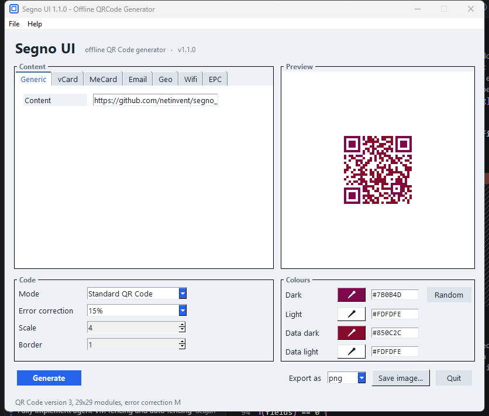

# Segno UI - An open source offline QR Code generator

This program is a graphical user interface for the [segno library](https://github.com/heuer/segno) that allows to create QR codes.

While segno has a nice CLI interface, a graphical user interface fills the gap for quick usage.

The main goal of Segno UI is to provide a QRCode generator that doesn't need any online tools, which guarantees that the data you're encoding doesn't leave your computer.
Using online generators needs you to put your trust in developper behind the tool, hoping that your data won't be stored or reselled.

## Quick usage

You may find **precompiled binaries for Windows** on the [release page](https://github.com/netinvent/segno_ui/releases).

We don't provide precompiled binaries for Linux or MacOS, as those generally come with a Python interpreter already.

Install with:
```
python3 -m pip install segno_ui
```

Use with:
```
segno_ui
```

`segno_ui --version` prints the version, `segno_ui --debug` logs GUI events and re-raises errors instead of only showing them.

Depending on your system, you might need to install tkinter. Install with
| System                                 | command                                  |
|----------------------------------------|------------------------------------------|
| RHEL 8+, Fedora and clones             | `dnf install python3-tkinter`            |
| RHEL and earlier Fedora and clones     | `yum install tkinter`                    |
| Debian, Ubuntu, Mint based             | `sudo apt-get install python-tk`         |
| Arch based                             | `sudo pacman -S tk`                      |
| Windows                                | Select 'tk' when installing Python       |

## Graphical user interface

The code is regenerated on every change, and the status bar tells you what came
out of it: symbol kind, version, module count and error correction level. A tab
you have not typed anything into yet simply reports that there is nothing to
encode, problems are only reported once there is something to report them about.

Presets are imported and exported as json files from the **File** menu.

The window adapts to what you are doing:

- **EPC** payment codes are built by segno itself, which enforces the error correction level and version the EPC specification mandates. `Mode` and `Error correction` are therefore greyed out on that tab.
- **Mini QR Codes** cannot carry the 33% error correction level, so that choice disappears from the list when you switch to that mode.
- Each colour picker doubles as a swatch showing the colour currently in use, with a
  pipette drawn on it in whichever shade stands out against that colour.
- **Random** rolls a colour scheme that still scans. The light end stays close to
  white, since a tinted background costs more readability than a saturated dark
  colour buys back, and nothing is accepted below an 8:1 contrast ratio. How bright
  the dark colour may go is worked out per hue rather than fixed: against white a
  blue holds its contrast to about half lightness while a yellow is spent by a
  fifth of it, so hues are also drawn in proportion to the headroom they have. Every
  hue can still come up, blues and violets simply come up more often. These bounds
  were settled by decoding rendered codes through simulated camera noise rather than
  picked off a chart.
- Fields segno would forward verbatim are offered as a list rather than free text: Wifi `Security` is a selector (`WPA`, `WEP`, `nopass`, `SAE`, `WPA2-EAP`, or empty to omit it) and `Hidden` is a checkbox.
- The preview keeps a fixed size, so changing the scale or switching tabs never makes the window jump around. A code too big to fit is shrunk to fit rather than clipped, and the status bar says so. The export always uses the scale you picked.

> **Settings files are written in clear text.** A preset holding a Wifi password or vCard details is as sensitive as the data itself, so store it accordingly. Segno UI warns you when it saves a preset containing a password.




## Technical stuff

Basically, Segno UI is a wrapper using the excellent [FreeSimpleGUI ](https://github.com/spyoungtech/FreeSimpleGUI) toolkit allowing to create multiplatform GUI interfaces easily.

It should be quite future proof since all properties that go into the QR codes are dynamically generated by reading the qrcode maker function signatures.
Hence, if segno adds a new parameter, it will automatically exist in Segno UI.

Currently, the windows executable is a compressed file which will take a couple of seconds to load.
While Nuitka can add a splash screen while loading, this is not yet supported on MinGW compiler.

### Windows compilation

windows compilation was done using [Nuitka](https://github.com/nuitka/nuitka)

In order to compile, you'll need Nuitka a C compiler (both MinGW and Visual C are accepted).

#### Install compiler

Update: With Nuitka 1.2, we don't need to manually download the compiler anymore. It will propose to download a compiler from [here](https://github.com/brechtsanders/winlibs_mingw/releases/download/11.3.0-14.0.3-10.0.0-msvcrt-r3/winlibs-i686-posix-dwarf-gcc-11.3.0-llvm-14.0.3-mingw-w64msvcrt-10.0.0-r3.zip)


We'll download mingw as compiler (project URL https://mingw-w64.org/)
Your compiler should be in those paths depending on your target architecture
```
C:\MINGW\mingw32\bin\gcc.exe
C:\MINGW\mingw64\bin\gcc.exe
```

#### Install nuitka
```
python.exe -m pip install nuitka ordered-set zstandard
```

#### Compilation

Here are the compiling instructions so you can create your own segno distribution files for Windows.

The following command should produce a target called `segno_ui.exe` which is portable for Windows 7 or newer.
```
python.exe -m nuitka --onefile --plugin-enable=tk-inter --windows-icon-from-ico=pics\segno_ui.ico "c:\segno_ui\segno_ui\segno_ui.py"
```

The application icon is a QR Code finder pattern. It lives twice in the tree: as
a base64 payload in `segno_ui/segno_ui.py`, which is what the running window and
its popups use, and as `pics/segno_ui.ico` for the Windows build above. Both are
produced by `contrib/make_icon.py`, a maintenance script needing Pillow, which
segno_ui itself does not depend on. Run it only when the icon has to change.

## Tests

The test suite is graphical-free, so it runs anywhere including on a CI runner without a display server:
```
python3 -m pip install pytest
python3 -m pytest tests
```

## Why

I've built this tool to quickly create / store settings for some vCards / MeCards without going online.

All help is welcome ;)
